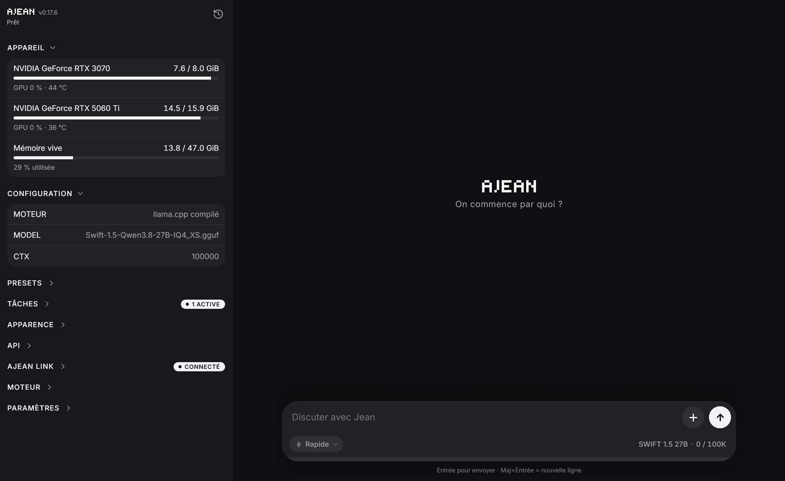

# AJEAN

**English** · [Français](README.fr.md)



**Run your own AI at home.** AJEAN is a single program that turns a computer with a graphics card (or a plain CPU) into a complete AI assistant: a chat interface, memory, tools, web access, scheduled tasks, and access from your phone, with nothing leaving your machine.

AJEAN handles everything around the model. The model itself runs on [llama.cpp](https://github.com/ggml-org/llama.cpp), which AJEAN installs and keeps up to date for you.

- **One file, no dependencies.** No Docker, no Python, no runtime to install. Linux, Windows and macOS.
- **An assistant, not just a model.** It remembers, organizes work into projects, runs commands, reads the web, drives a browser, and works on its own on a schedule.
- **Your data stays yours.** Everything runs on your machine. Memory and conversations can be encrypted at rest, and remote access is encrypted end to end.
- **Use it from anywhere.** The same conversations on your computer and your phone, live.
- **Plugs into your tools.** An OpenAI-compatible endpoint for any third-party app.

---

## Contents

- [Install](#install)
- [Using AJEAN](#using-ajean)
- [What the AI can do](#what-the-ai-can-do)
- [Models and engine](#models-and-engine)
- [Access from anywhere](#access-from-anywhere)
- [Your data](#your-data)
- [Reference](#reference)
- [Build from source](#build-from-source)

---

## Install

Download the file for your system from the [latest release](https://github.com/nathaninline/ajean/releases/latest):

| System | File |
|---|---|
| Windows | `ajean-windows.exe` (`ajean-windows-arm.exe` for ARM) |
| macOS | `ajean-macos-arm.zip` (Apple Silicon), `ajean-macos.zip` (Intel) |
| Linux | `ajean-linux` (`ajean-linux-arm` for ARM) |

### Windows

Double-click `ajean-windows.exe`. AJEAN installs itself, adds its shortcuts, and opens in its own window, with an icon in the notification area (*Open AJEAN* / *Quit*). Running a newer file later updates the installed copy.

Then, in the interface:

1. **Engine** section: install llama.cpp. The pre-built version is ready in about two minutes; the compiled version is tuned for your machine but takes longer.
2. **Presets** section: create a preset, pick or download a model (any direct `.gguf` link, for example from Hugging Face).

### macOS

Unzip, drag **AJEAN.app** into *Applications*, then **right-click and Open** the first time (the app is only ad-hoc signed). AJEAN opens in its own window and lives in the menu bar. Then install the engine and add a model as on Windows.

For command-line use, take the bare binary `ajean-macos-arm` / `ajean-macos` instead of the app.

### Linux (server)

```bash
curl -L -o ajean https://github.com/nathaninline/ajean/releases/latest/download/ajean-linux
chmod +x ajean && sudo mv ajean /usr/local/bin/ajean

sudo ajean install        # services, permissions, folders
ajean llamacpp install    # builds llama.cpp for the GPU present
ajean edit                # set MODEL=/path/to/model.gguf
ajean start               # starts the model
ajean ui start            # interface at http://<host>:8090
```

Building llama.cpp needs `git`, `cmake` and your GPU toolkit (CUDA for NVIDIA, ROCm or the Vulkan SDK for AMD, the Vulkan SDK for Intel). AJEAN installs what it can by itself, and tells you what to do when it cannot. To force a backend: `ajean llamacpp install --backend=vulkan` (or `cuda`, `hip`, `cpu`).

On Linux, AJEAN runs as **two services**: `ajean-engine` runs the model, `ajean-ui` serves the interface, remote access and the OpenAI endpoint. Restarting the interface is instant and never reloads the model.

### Updating

```bash
ajean update
```

Or the update button in the interface. Each release is verified against its published checksums before it is installed.

---

## Using AJEAN

### Four chat modes

Pick a mode from the button on the left of the input bar.

| Mode | For | What the AI has |
|---|---|---|
| **Quick** | quick questions, small tasks | terminal and files, no memory |
| **Project** | real work that spans several conversations | memory, trackers, web, browser, MCP, tasks |
| **Jean** *(beta)* | a personal assistant that knows you | its own memory, reminders, a single ongoing conversation |
| **Base model** | talking to the raw model | nothing: no tools, no system prompt |

A conversation keeps the mode it started in. Tools only exist when **agent mode** is on (`ajean agent on`, or the switch in the interface); without it, every mode behaves like Base model.

### Projects

A project is a workspace with **its own memory and its own conversations**, isolated from the others: one for your mailbox automation, one for a piece of software, one for your notes. Switch project from the bubble in the input bar.

Each project has:

- **A memory**: Markdown pages the AI reads and writes across conversations, with an index kept up to date automatically.
- **Trackers**: dated data that keeps growing (a weekly subscriber count, a weight, a revenue figure). The AI browses them level by level instead of loading everything.
- **A description**, given to the AI at the start of every conversation (context, constraints, tone).
- **Options** in its *⋯* menu: name and description, its memory, its trackers.

### Jean, personal assistant (beta)

Jean is an assistant that remembers **you** over time, in a single conversation that never ends. Open it from the mode menu: it gets a full-screen view with its avatar.

- **Its own memory**: a short profile (name, family, preferences, habits), *fiches* (procedures, recipes, guides kept in full), and a journal where every exchange is logged and searchable. The *Jean memory* window lets you review, edit or delete all of it.
- **Reminders and tasks**: ask Jean to remind you of something, and the reminder arrives as a message from Jean, with a notification.
- **A separate workspace**: Jean cannot modify your projects' scripts, files or memory. It can read them, to see how something was done, and rebuild what it needs in its own space.
- **A fresh start after a break**: after 3 hours without a message, the model's context starts over. The thread on screen and the journal stay. Set `JEAN_IDLE_HOURS` to change the delay (`0` = never).

> Jean is a **beta**: not everything has been tested yet. For serious work, keep using Project or Quick mode.

### History

The clock icon at the top of the side menu switches to the history. It follows what you are doing: the active project's conversations in Project mode, the quick conversations in Quick mode, the Base model conversations in Base model mode. Search covers every conversation. Conversations can be renamed, pinned as favorites, moved to another project, and exported to Markdown or JSON.

Conversations live on the server, so they are the **same on every device**, live: start a question on your computer, read the answer on your phone. Closing the browser never stops a reply.

### In the terminal

```bash
ajean chat
```

A lightweight chat in the terminal, independent from the web interface, with three tools (`bash`, `write`, `edit`) that work **in the folder where you run it**. Handy for working on a project directory.

---

## What the AI can do

These tools are given to the model only when agent mode is on.

**Terminal and files.** The AI runs commands (bash, or `cmd.exe` on Windows) and writes or edits files. It works in a disposable **workspace**; scripts worth keeping go into a separate **scripts** folder that a cleanup never touches.

**Memory.** Per project, four settings: *injected* (the index is loaded up front), *search* (the AI looks things up when needed, lighter on context), *on demand* (only when you ask), or *off*.

**Web.** `web_search`, `web_open`, `web_read` and `web_grep`. The built-in engine works out of the box. For pages that need JavaScript, connect a [Crawl4AI](https://github.com/unclecode/crawl4ai) server you host:

```bash
ajean internet on                          # built-in engine
ajean internet engine crawl4ai             # or a Crawl4AI server
ajean internet url http://localhost:11235
```

**Browser control.** With `ajean computer on`, the AI drives a real Chrome, Chromium or Edge on the machine: open a page, click, type, scroll. It targets elements through the accessibility tree, so it works even with small text-only models. You see a live preview while it browses.

**Images.** Attach an image to a message, and a multimodal model sees it and can use it. Images are resized before being sent.

**Files.** Send files to the AI from the chat (up to 1 GB each), and download the files it creates with a click.

**MCP servers.** Plug in any [Model Context Protocol](https://modelcontextprotocol.io) server (files, databases, mail, APIs) from the interface, over stdio or HTTP. The format is the one used by Claude Desktop, so an existing configuration copies over as is. Servers and individual tools can be switched on and off.

**Scheduled tasks.** The AI works on its own, at the frequency you choose (every N minutes, hours or days, or a cron expression): check a mailbox, summarize news, follow a figure. A task can also be a **script only**, run without loading the model. Each task chooses its project, its preset, and whether it may use memory and the web. A master switch pauses everything.

**Notifications.** Get notified when a reply is ready, even with the app closed or the phone locked. On iPhone, add AJEAN to the home screen first.

**Long conversations.** When the context fills up, older turns are summarized automatically. Long tool results are archived and can be recalled by the AI when needed, so nothing is truly lost.

---

## Models and engine

### Presets

A preset is a complete model configuration: model file, context size, GPU layers, KV cache, sampling, reasoning, speculative decoding, vision. Switching preset reloads the model, from the interface or with `ajean switch`. Presets are edited in the interface; `.gguf` files can live on any disk.

A preset does not have to run on this machine:

| Execution | What it does |
|---|---|
| **This machine** | llama.cpp on your GPUs (choose which ones per preset) |
| **External API** | any OpenAI-compatible endpoint |
| **GPU Cloud** | a GPU rented on [Modal](https://modal.com) (T4 to B200), deployed by AJEAN, billed by use, asleep when idle |

### Engine

The **Engine** section installs and updates llama.cpp in three flavors, chosen per preset:

- **pre-built**: the official llama.cpp binaries, ready in minutes;
- **compiled**: built for this machine (CUDA with the right compute capability for each GPU, ROCm, Metal, Vulkan or CPU);
- **custom**: any fork, from a Git URL, for models that need a special engine.

**Third-party engine (Linux).** An External API preset can name a systemd unit with `EXTERNAL_SERVICE=ajean-<name>`. AJEAN starts it when you switch to the preset, stops it when you switch away, and waits for the GPUs to be released before loading the next model. Give the unit `Conflicts=ajean-engine.service`.

---

## Access from anywhere

### ajean.link

`ajean link <token>` (or the *Remote access* panel) connects your server to the [ajean.link](https://ajean.link) relay through an **outbound** connection: no port to open, works behind any router or CGNAT. You then use AJEAN from [app.ajean.link](https://app.ajean.link), on any device.

It is an optional paid service (4.80 EUR/month). Everything else in AJEAN is and will stay open source and free.

**The relay is blind.** It carries your data without being able to read it:

- everything (chat and settings) is encrypted end to end between your browser and your server (X25519, AES-GCM);
- the key is derived from your password (OPAQUE) and never leaves the browser;
- each browser is paired once with a single-use code (`ajean link code`), and requests cannot be forged or replayed;
- the web app is served from an independent origin (GitHub Pages), so the relay cannot inject code.

The relay only sees technical metadata (machine online, loaded model, VRAM), never your conversations.

**Backups (subscribers).** Memory, presets and settings can be backed up to ajean.link, by hand or daily. They are encrypted on your server first: the relay only stores an unreadable blob.

### OpenAI-compatible endpoint

Any tool that speaks the OpenAI API can use your model:

- **on your network**: `ajean network on` makes the endpoint reachable on the LAN;
- **on the internet**: an opt-in public address `https://<machine>.oai.ajean.link/v1`, authenticated with your API key. TLS ends on your machine; the relay only passes encrypted traffic through.

---

## Your data

Everything lives under **`$AJEAN_HOME`**: `/etc/ajean` on Linux, `%ProgramData%\ajean` on Windows, `/etc/ajean` or `~/Library/Application Support/ajean` on macOS. `ajean where` shows the exact paths.

| | |
|---|---|
| `ajean.db` | settings, conversations, keys (a single [bbolt](https://github.com/etcd-io/bbolt) database) |
| `presets/` | one `.env` file per preset |
| `memory/` | memory pages, one folder per project |
| `models/` | `.gguf` files |
| `backends/` | the llama.cpp engines |
| `workspace/` | the AI's disposable working folder |
| `scripts/` | the scripts the AI keeps |

**Encryption at rest** (optional, one switch in the settings) encrypts memory and conversations with AES-256. The key is your access key to the interface: it lives only in your browsers, the server keeps just its fingerprint. A **recovery key** is given when you turn it on. A snapshot is taken before every switch, so nothing can be lost.

---

## Reference

### Commands

```
Engine (ajean-engine)
  start | stop | restart        manage the service
  status | logs                 state / live logs
  enable | disable              start on boot
  edit                          edit the configuration in $EDITOR
  switch [N]                    change preset
  test | bench [N]              check the model answers / measure speed
  vram | gpu [index...]         GPU memory / choose the GPUs (gpu all = all)
  set-api-key [key]             protect the model's API
  network [on|off|status]       OpenAI endpoint on the local network

Interface (ajean-ui)
  ui [start|stop|restart|status]
  web [PORT]                    serve the interface in the foreground (default :8090)
  set-web-key [key]             protect the control API

AI
  chat                          terminal chat (tools in the current folder)
  export [options] [file]       export the conversation (--json, --last N...)
  agent [on|off|status]         give the AI its tools
  computer [on|off|status]      browser control
  memory [off|ondemand|always|search|status]
  internet [on|off|status|engine <go|crawl4ai>|url <url>|key <key>]

Remote access (ajean.link)
  link <token> | link code | link status | link logout | link newid

llama.cpp engine
  llamacpp install [--backend=vulkan|cuda|hip|cpu]
  llamacpp update | status | uninstall <compiled|prebuilt|custom <name>>

Installation
  install | uninstall | update [--check] | where | version
```

### Configuration keys

`ajean edit` opens the active configuration as `key=value`:

| Key | Meaning | Default |
|---|---|---|
| `BIN` | path to `llama-server` | set by the engine install |
| `MODEL` | `.gguf` file name or path | none |
| `HOST` / `PORT` | engine address and port | `0.0.0.0` / `8080` |
| `CTX` | context size | `32768` |
| `NGL` | layers on the GPU | `999` |
| `BATCH` / `UBATCH` | batch sizes | `2048` / `512` |
| `THREADS` / `THREADS_BATCH` | CPU threads | auto |
| `KV_TYPE` (`_K` / `_V`) | KV cache quantization | none |
| `CUDA_VISIBLE_DEVICES` | GPUs used | all |
| `REASONING` | `on` / `off` / `auto` / `deepseek` | none |
| `REASONING_BUDGET` | thinking token cap (`-1` = unlimited) | `-1` |
| `REASONING_EFFORT` | `low` / `medium` / `high`, depending on the model | none |
| `COMPACT` | automatic context compaction (`off` to disable) | on |
| `MEM_MODE` | default memory mode (projects can override it) | `always` |
| `JEAN_IDLE_HOURS` | hours of silence before Jean starts a fresh context (`0` = never) | `3` |
| `EXTRA_ARGS` | added as is to the llama-server command line | none |

### Environment variables

| Variable | Role | Default |
|---|---|---|
| `AJEAN_HOME` | data folder | see [Your data](#your-data) |
| `AJEAN_MODEL_DIRS` | extra model folders (`:` separated, `;` on Windows) | none |
| `AJEAN_SERVICE` | name of the engine unit | `ajean-engine` |
| `AJEAN_CHROME` | browser used for browser control | auto-detected |
| `AJEAN_DL_CONNS` | parallel connections for model downloads (max 16) | `8` |
| `HF_TOKEN` | Hugging Face token for private models | none |
| `EDITOR` | editor for `ajean edit` | `nano` / `notepad` |

### Control API

The interface service exposes an HTTP API. Protect it with `ajean set-web-key`, then send `Authorization: Bearer <key>` with every `/api/*` call.

| Method | Endpoint | Role |
|---|---|---|
| GET | `/api/ping` | connectivity and key check |
| GET | `/api/status` · `/api/vram` | service state · GPUs |
| GET | `/api/presets` | presets, with the active one |
| POST | `/api/start` · `/api/stop` · `/api/restart` | drive the engine |
| POST | `/api/chat` `{"messages":[...]}` | chat (SSE stream) |

The key travels in the clear over HTTP: for public exposure, put HTTPS in front or use ajean.link.

---

## Build from source

Go 1.25 or later. AJEAN is pure Go; the interface is embedded in the binary.

```bash
git clone https://github.com/nathaninline/ajean.git
cd ajean
CGO_ENABLED=0 go build -o ajean ./cmd/ajean   # Linux, Windows
go build -o ajean ./cmd/ajean                 # macOS (the menu bar icon needs CGO)
```

**Layout**

- `cmd/ajean/`: entry point and Windows resources.
- `internal/ajean/`: all the code, files grouped by prefix (`web_*`, `chat_*`, `llm_*`, `backend_*`, `relay_*`, `sys_*`, `mcp_*`, `jean_*`); a map in `doc.go`.
- `internal/ajean/ui/`: the web interface. `index.html` is **generated**: edit `ui/src/`, then run `go generate ./internal/ajean`.
- `tools/`: build helpers (`assemble-ui`, `gen-icon`, `verify-i18n`).

The interface is available in English and French; see [docs/TRANSLATING.md](docs/TRANSLATING.md) to add a language.

## License

[MIT](LICENSE). The embedded `marked.min.js` is [Marked](https://github.com/markedjs/marked), also MIT.
